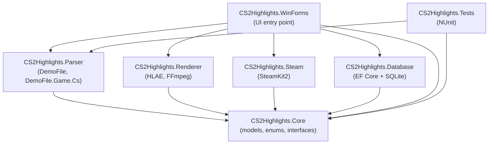

# CS2 Highlights — Automated Highlight & Lowlight Recorder
### Technical Design Document | v1.0

---

## Purpose

A personal local tool that automatically fetches CS2 match demos via Steam, parses them to detect highlights and lowlights, and renders video clips using HLAE + FFmpeg — with zero manual input.

**Developer machine:** Intel i5-13400F | 32GB DDR4-3200 (dual channel) | RTX 2060 6GB | Windows 11

---

## Table of Contents

1. [Project Overview](#1-project-overview)
2. [Required Software](#2-required-software)
3. [Solution Architecture](#3-solution-architecture)
4. [Project Details](#4-project-details)
5. [Highlight & Lowlight Detection Rules](#5-highlight--lowlight-detection-rules)
6. [Render Options Panel](#6-render-options-panel)
7. [Recommended Build Order](#7-recommended-build-order)
8. [VAC Safety & Hardware Notes](#8-vac-safety--hardware-notes)
9. [Glossary](#9-glossary)

---

## 1. Project Overview

This is a **personal home-use application** — not intended for public deployment. It runs entirely on one Windows machine where CS2 is already installed. The user never touches HLAE manually; the app automates every step from demo download to finished `.mp4` clip.

### 1.1 End-to-End User Flow

```
1. Launch the WinForms desktop app
2. Enter Steam ID + Auth Code once (saved to SQLite)
3. App fetches recent matches from Steam API
4. Select a match from the list
5. App downloads the .dem file and parses it automatically
6. App shows detected highlights and lowlights with round details
7. Configure render options (resolution, FPS, what to include)
8. Click Render — CS2 opens silently, renders clips, closes
9. Browse finished .mp4 clips in the Clip Gallery
```

Steps 8 and 9 are fully automatic. The user just waits ~2 minutes.

### 1.2 Key Design Principles

- **Zero manual HLAE interaction** — fully automated via CLI arguments and `.cfg` scripts
- **Parse once, render many** — demo parsed once into SQLite; re-render with different settings anytime without re-parsing
- **Personal machine only** — no cloud, no auth server, no deployment concerns
- **User-configurable detection** — every highlight/lowlight rule has toggles and thresholds in the UI

---

## 2. Required Software

### 2.1 Development Tools

| Software | Version | Purpose | Where |
|---|---|---|---|
| Visual Studio 2026 Community | Latest | C# IDE | visualstudio.microsoft.com |
| .NET 10 SDK | 10.x | App runtime (bundled with VS) | dotnet.microsoft.com |
| Git | Latest | Version control | git-scm.com |
| DB Browser for SQLite | Latest | Inspect local database | sqlitebrowser.org |

### 2.2 Runtime Tools

| Software | Purpose | Notes |
|---|---|---|
| CS2 (Steam) | Plays back demo files for rendering | Already installed |
| HLAE | Injects into CS2, controls frame capture | advancedfx.org — free |
| FFmpeg | Encodes frames to .mp4 | Installed via `winget install Gyan.FFmpeg` |

### 2.3 NuGet Packages

| Package | Project | Purpose |
|---|---|---|
| `DemoFile` + `DemoFile.Game.Cs` | Parser | Parses CS2 `.dem` files — kills, ticks, rounds, player events |
| `SteamKit2` | Steam | Steam Game Coordinator — fetch share codes + demo download URLs |
| `Microsoft.Data.Sqlite` | Database | SQLite access |
| `Microsoft.EntityFrameworkCore.Sqlite` | Database | EF Core ORM for SQLite |
| `Microsoft.EntityFrameworkCore.Tools` | Database | EF Core CLI tools for running migrations |
| `Serilog` + `Serilog.Sinks.File` | Renderer, WinForms | Logging — critical for debugging HLAE/CS2 launch issues |
| `Microsoft.Extensions.DependencyInjection` | WinForms | DI container wired up in `Program.cs` — injects services into forms |

### 2.4 FFmpeg Setup

FFmpeg is installed via winget and is already on the system PATH:

```
winget install Gyan.FFmpeg

Installed path: C:\Users\Newgear\AppData\Local\Microsoft\WinGet\Links\ffmpeg.exe

Verify: open PowerShell and run:
  ffmpeg -version
```

The app reads the FFmpeg path from `appsettings.json` (`Paths.FfmpegExe`) and passes it explicitly to HLAE via the generated `.cfg` script — no manual PATH configuration needed.

---

## 3. Solution Architecture

### 3.1 Project Structure

```
CS2Highlights.slnx
├── CS2Highlights.Core          Business logic, models, interfaces — no UI dependencies
├── CS2Highlights.Parser        .dem file parsing + highlight/lowlight detection
├── CS2Highlights.Renderer      HLAE + FFmpeg orchestration
├── CS2Highlights.Steam         Steam API + demo downloading
├── CS2Highlights.Database      SQLite via EF Core
├── CS2Highlights.WinForms      .NET 10 Windows Forms desktop app
└── CS2Highlights.Tests         Unit tests for parsers and detectors
```

### 3.2 Project Dependency Diagram



### 3.3 Data Flow

```
[Steam API]
    │  GetNextMatchSharingCode → chain walk → demo download URL
    ▼
[DemoDownloader]  →  saves .dem  →  /demos/matchId.dem
    │
    ▼
[DemoParser]      →  raw events  →  SQLite: kills, deaths, nades (per tick)
    │
    ▼
[HighlightDetector]  →  applies rules  →  SQLite: highlights table (type, tick range)
    │
    ▼
[RenderOptionsPanel]  ←  user selects what to render + settings
    │
    ▼
[RenderQueue]     →  one RenderJob per clip
    │
    ▼
[CfgScriptBuilder]  →  generates .cfg script per clip
    │
    ▼
[HlaeRenderer]    →  launches CS2+HLAE  →  frames  →  FFmpeg  →  .mp4
    │
    ▼
[ClipGallery]     →  user browses finished clips
```

---

## 4. Project Details

### 4.1 CS2Highlights.Core

#### Models

```
Match.cs          MatchId, SteamId, Map, Date, Score, DemoPath, ParsedAt
Round.cs          RoundNumber, TickStart, TickEnd, WinnerSide
PlayerEvent.cs    Base: Tick, SteamId, RoundNumber
KillEvent.cs      : PlayerEvent + Weapon, IsHeadshot, IsWallbang, IsNoscope, VictimSteamId
GrenadeEvent.cs   : PlayerEvent + GrenadeType, DamageToEnemies, DamageToTeam,
                    EnemiesBlinded, TeammatesBlinded
ClutchEvent.cs    : PlayerEvent + EnemyCount, Result (Win/Loss), TickResolved
DeathEvent.cs     : PlayerEvent + KillerSteamId, TimeIntoRound (seconds)
Highlight.cs      HighlightId, MatchId, Type, TickStart, TickEnd,
                  RoundNumber, Description, ClipPath (nullable)
```

#### Enums

```
HighlightType:   MultiKill3, MultiKill4, MultiKill5 (Ace), Clutch, EntryFrag,
                 Wallbang, HeadshotStreak, OuunumberedWin
LowlightType:    DeathStreak, FriendlyFire, FailedClutch, FirstBloodAgainst,
                 BombDropDeath, TeamFlash, TeamMolotov, WastedGrenade
GrenadeType:     HE, Molotov, Incendiary, Flash, Smoke, Decoy
ClutchResult:    Win, Loss
RenderStatus:    Queued, Rendering, Done, Failed
```

#### Interfaces

```csharp
IDemoParser          ParseAsync(string demoPath, string steamId) → ParsedMatch
IHighlightDetector   DetectAsync(ParsedMatch, DetectionOptions) → List<Highlight>
IClipRenderer        RenderAsync(RenderJob) → string clipPath
ISteamService        GetMatchesAsync(string steamId) → List<MatchInfo>
                     DownloadDemoAsync(MatchInfo) → string demoPath
```

---

### 4.2 CS2Highlights.Parser

#### DemoParser.cs

Wraps `DemoFile.Game.Cs`. Reads the `.dem` binary, subscribes to game events, and emits typed C# objects. Returns a `ParsedMatch` containing all raw events sorted by tick.

#### Detectors (one class per rule)

| Detector | Input | Logic | Output |
|---|---|---|---|
| `MultiKillDetector` | KillEvents per round | Group kills by (round, attacker). Count >= threshold. | MultiKill3/4/5 Highlight |
| `ClutchDetector` | Kill/Death events + alive counts | Track alive per team per tick. Flag when player is last alive 1vX. | Clutch Win or Loss Highlight |
| `EntryFragDetector` | KillEvents | First kill of round within N seconds of round start tick. | EntryFrag Highlight |
| `DeathStreakDetector` | DeathEvents | Count consecutive rounds where player died first (< 8s). Flag at N >= threshold. | DeathStreak Lowlight |
| `FriendlyFireDetector` | GrenadeEvents + DamageEvents | Teammate damage >= threshold in a single round. | FriendlyFire Lowlight |
| `GrenadeDetector` | GrenadeEvents | Flash blinded only teammates. Molotov damaged only team. Low dmg HE/molotov (user threshold). | TeamFlash / TeamMolotov / WastedGrenade Lowlight |
| `FailedClutchDetector` | ClutchEvents | Was last alive 1v1. Enemy HP < 50. Round lost. | FailedClutch Lowlight |

---

### 4.3 CS2Highlights.Steam

#### ShareCodeService.cs

Calls `ICSGOPlayers_730/GetNextMatchSharingCode` with a starting share code + user auth token. Chains calls forward until no new codes are found. Returns an ordered list of match share codes.

#### DemoDownloader.cs

Decodes share code to match ID via SteamKit2. Requests demo download URL from Steam Game Coordinator. Downloads `.dem` file to `/demos/` directory. Skips if already downloaded (SHA check).

> **Steam API Key required:** get one free at steamcommunity.com/dev/apikey. Store in `appsettings.json` — never commit to git.

---

### 4.4 CS2Highlights.Renderer

#### CfgScriptBuilder.cs

Generates a CS2 console script (`.cfg`) for each clip. Example output for one highlight:

```
playdemo "C:\demos\match_abc123.dem"
demo_gototick 44800
spec_lock_to_accountid 123456789
mirv_streams add normal myCapture
mirv_streams settings edit myCapture record 1
mirv_streams record start
demo_gototick 46500
mirv_streams record end
quit
```

#### HlaeRenderer.cs

Builds HLAE CLI arguments and launches the process via `Process.Start`. Waits for CS2 to exit. Checks output file exists before reporting success.

```
E:\Works\HLAE\HLAE.exe
  -csgo
  -steam
  -autoConfig "C:\CS2Highlights\cfg\job_001.cfg"
  -noGui
  -mmcfgEnabled true
  -mmcfg "C:\CS2Highlights\cfg\mirv_base.cfg"
```

#### FfmpegEncoder.cs

Called by HLAE via `mirv_streams` pipe. Configured to use `h264_nvenc` (RTX 2060 NVENC) for fast encoding without competing with CS2's GPU rendering load.

```
Recommended FFmpeg args for RTX 2060:
  -c:v h264_nvenc -preset p4 -b:v 20M -pix_fmt yuv420p -vf scale=1920:1080

CS2 playback resolution : 1280x720  (saves VRAM during render)
Output resolution       : 1920x1080 (upscaled by FFmpeg after capture)
host_framerate          : 300
Expected VRAM usage     : ~3.5GB / 6GB
```

#### RenderQueue.cs

Holds a list of `RenderJob` objects. Processes them sequentially — one CS2 instance at a time. Each job contains: demo path, tick start, tick end, player SteamId, and `RenderSettings`. Reports progress back to the WinForms UI via `IProgress<RenderProgress>` on a `BackgroundWorker`.

---

### 4.5 CS2Highlights.Database

#### Tables

```
Matches          Id, SteamId, Map, Date, Score, DemoPath, ParsedAt
Rounds           Id, MatchId, RoundNumber, TickStart, TickEnd, WinnerSide
KillEvents       Id, MatchId, RoundId, Tick, KillerSteamId, VictimSteamId,
                 Weapon, IsHeadshot, IsWallbang, IsNoscope
GrenadeEvents    Id, MatchId, RoundId, Tick, ThrowerSteamId, GrenadeType,
                 DmgToEnemies, DmgToTeam, EnemiesBlinded, TeammatesBlinded
Highlights       Id, MatchId, RoundId, Type, TickStart, TickEnd,
                 Description, ClipPath, RenderStatus
RenderJobs       Id, HighlightId, QueuedAt, StartedAt, FinishedAt,
                 Status, ErrorMessage
UserSettings     Key, Value   (Steam API key, HLAE path, FFmpeg path, etc.)
```

---

### 4.6 CS2Highlights.WinForms

Single executable desktop app. No web server, no browser required. All forms share a singleton `AppDbContext` and call Core/Steam/Renderer services directly.

#### Forms / Panels

```
MainForm          Tab container hosting all panels below
├── DashboardPanel    Recent matches list (DataGridView) + pending render jobs
├── MatchesPanel      All fetched matches — map, date, score, parse status (DataGridView)
├── MatchDetailPanel  Round timeline + highlights/lowlights list for one match
├── RenderPanel       Render options + live queue progress (ProgressBar + log ListBox)
├── ClipGalleryPanel  Finished .mp4 files — list view + "Open in Explorer" button
└── SettingsPanel     Steam ID, Auth Code, API Key, HLAE path, FFmpeg path
```

#### Detection Settings (SettingsPanel)

Each highlight/lowlight type from Section 5 gets one row: a `CheckBox` toggle and a `TrackBar` (or `NumericUpDown`) for its threshold. Values are persisted to the `UserSettings` table on change.

#### Render Progress

`RenderQueue` accepts an `IProgress<RenderProgress>` instance. The WinForms `RenderPanel` creates a `Progress<T>` that marshals updates back to the UI thread — no SignalR needed. A `ProgressBar` shows per-job completion; a `ListBox` streams log lines from HLAE stdout.

#### appsettings.json (DO NOT COMMIT — add to .gitignore)

```json
{
  "Steam": {
    "ApiKey": "YOUR_STEAM_API_KEY",
    "SteamId": "YOUR_STEAM_ID_64",
    "AuthCode": "YOUR_GAME_AUTH_CODE",
    "StartShareCode": "CSGO-XXXXX-XXXXX-XXXXX-XXXXX-XXXXX"
  },
  "Paths": {
    "HlaeExe": "E:\\Works\\HLAE\\HLAE.exe",
    "FfmpegExe": "C:\\Users\\Newgear\\AppData\\Local\\Microsoft\\WinGet\\Links\\ffmpeg.exe",
    "DemosFolder": "C:\\CS2Highlights\\demos",
    "ClipsFolder": "C:\\CS2Highlights\\clips",
    "CfgFolder":   "C:\\CS2Highlights\\cfg"
  },
  "Database": {
    "Path": "C:\\CS2Highlights\\cs2highlights.db"
  },
  "Logging": {
    "LogFolder": "C:\\CS2Highlights\\logs"
  }
}
```

> **Always add `appsettings.json` to `.gitignore` before first commit.**

---

## 5. Highlight & Lowlight Detection Rules

### 5.1 Highlights

| Type | Trigger Condition | Default Threshold | User Adjustable? |
|---|---|---|---|
| Multi-Kill (3K/4K/5K) | N kills by same player in one round | N >= 3 | Yes — minimum kills slider |
| Ace | 5 kills by same player in one round | Always 5 | No (fixed) |
| True Clutch | Last player alive on team + 1+ enemies + round WIN | Any 1vX | No |
| Outnumbered Win | At any point 1v2 or more during round + round WIN | 1v2 minimum | Yes |
| Entry Frag | First kill of round within N seconds of round start | < 8 seconds | Yes — time slider |
| Wallbang Kill | Kill with penetration flag set in demo | Any | Toggle on/off |
| Headshot Streak | N consecutive HS kills across rounds | 3 consecutive | Yes — count slider |

### 5.2 Lowlights

| Type | Trigger Condition | Default Threshold | User Adjustable? |
|---|---|---|---|
| Death Streak | Player died first in round N consecutive times | N >= 3 | Yes — count slider |
| Friendly Fire | Damage dealt to teammates in one round >= threshold | >= 40 HP | Yes — HP slider |
| Failed 1v1 Clutch | Last alive, 1v1, enemy HP < 50, round LOST | Enemy < 50 HP | Yes — HP slider |
| First Blood Against | Player died first < 8 sec into round, team lost round | < 8 seconds | Yes — time slider |
| Bomb Drop Death | Player carrying bomb, died before plant, team lost round | Any | Toggle on/off |
| Team Flash | Flash grenade blinded 2+ teammates, 0 enemies blinded | 2+ teammates | Yes — count slider |
| Team Molotov | Molotov/incendiary dealt damage only to teammates | Any amount | Toggle on/off |
| Wasted Grenade | HE/Molotov + 0 enemy damage + round lost + player died | Combined signal | Toggle on/off |
| Low Damage Grenade | HE or Molotov dealt < N damage to enemies | < 20 HP **(off by default)** | Yes — threshold + toggle |

### 5.3 What Cannot Be Detected

The following are **not detectable** from demo data and will not be implemented:

- Bad positioning (no positional intent data)
- Wrong utility usage timing (can see grenade thrown, not if it was correct)
- Passive holding vs. passive cowardice (indistinguishable)
- Poor communication (not in demo)
- Wrong weapon choice (subjective)

> The demo only records what happened — not intent or strategy.

---

## 6. Render Options Panel

All settings are saved to the `UserSettings` table in SQLite and persist between sessions.

### 6.1 Clip Settings

| Setting | Default | Range / Options |
|---|---|---|
| Buffer before event | 5 seconds | 1–15 seconds |
| Buffer after event | 3 seconds | 1–10 seconds |
| Output resolution | 1080p | 1080p / 720p |
| Output FPS | 60 | 60 / 120 |
| Camera perspective | First Person POV | First Person POV (Phase 1 only) |
| CS2 render resolution | 1280x720 | Internal — not user-facing |
| FFmpeg encoder | h264_nvenc | Auto-detected from GPU |

### 6.2 Toggle Reference

Every highlight and lowlight type in Section 5 has an individual toggle + threshold control in the UI. All default ON except **Low Damage Grenade** (default OFF — too many false positives without context).

---

## 7. Recommended Build Order

### Phase 1 — Foundation
- Core models, enums, interfaces
- Database schema + EF Core migrations
- Steam service: `GetNextMatchSharingCode` chaining + demo download
- WinForms shell: `MainForm` with tab layout + `SettingsPanel` (save API key, paths, Steam ID)

### Phase 2 — The Brain
- `DemoParser` wrapping `DemoFile.Game.Cs`
- `MultiKillDetector` + `ClutchDetector` (highest value, cleanest signals)
- `MatchesPanel` + `MatchDetailPanel` showing detected highlights in a `DataGridView`
- `EntryFragDetector` + `DeathStreakDetector` + `FriendlyFireDetector`

### Phase 3 — Rendering
- `CfgScriptBuilder` — generate `.cfg` scripts from highlight tick ranges
- `HlaeRenderer` — launch HLAE via `Process.Start`, wait for completion
- `FfmpegEncoder` — configure NVENC pipe
- `RenderQueue` + `IProgress<RenderProgress>` reporting to `RenderPanel` (`ProgressBar` + log `ListBox`)
- `ClipGalleryPanel` — lists finished `.mp4` files, "Open in Explorer" button

### Phase 4 — Polish
- Detection settings in `SettingsPanel`: `CheckBox` + `TrackBar` per rule, all toggles and thresholds
- `GrenadeDetector` (team flash, molotov, wasted grenade)
- `FailedClutchDetector` + `BombDropDetector`
- Unit tests for all detectors
- Error handling: HLAE crash recovery, retry logic

---

## 8. VAC Safety & Hardware Notes

### 8.1 VAC Ban Risk

**This app is safe.** VAC only scans processes when connecting to a VAC-protected server. This app never connects to a live server — it only plays back `.dem` files offline. HLAE injects only when launched through `HLAE.exe`. Launching CS2 normally through Steam means HLAE is completely dormant.

- Playing CS2 normally → launch via Steam → HLAE not involved at all ✅
- Rendering demos → app launches CS2 via HLAE → never connects to matchmaking ✅
- HLAE has been used for demo playback for 15+ years with Valve's knowledge ✅

### 8.2 Hardware Workload

| Component | Load During Render | Notes |
|---|---|---|
| GPU (RTX 2060) | 70–85% | CS2 rendering frames. NVENC on separate silicon — doesn't compete. |
| CPU (i5-13400F) | 1 P-core maxed (~4.6GHz) | HLAE single-thread RGB→BGR bottleneck. Other cores mostly idle. |
| RAM | 8–12 GB used | Frame buffer GPU→HLAE→FFmpeg. DDR4-3200 dual channel is ideal. |
| VRAM | ~3.5GB / 6GB | CS2 at 720p medium settings. Do NOT render at Ultra — VRAM overflow. |
| Thermals | Low — short bursts | 30-second clip renders in ~15 seconds. Not sustained load. |

### 8.3 Recommended Render Config

```
CS2 playback resolution : 1280x720
CS2 graphics settings   : Medium
host_framerate          : 300
FFmpeg encoder          : h264_nvenc  (NOT libx264 — use GPU not CPU)
Output resolution       : 1920x1080 (upscale post-capture)
Output bitrate          : 20 Mbps
Expected render speed   : ~1.5–2x realtime at 1080p/60fps
```

---

## 9. Glossary

| Term | Definition |
|---|---|
| `.dem file` | CS2 demo file — binary recording of a match containing all network events, player positions, kills, damage, grenades encoded as protobuf. |
| `HLAE` | Half-Life Advanced Effects. Free tool that injects into CS2 and exposes `mirv_streams` commands for programmatic frame capture. advancedfx.org |
| `mirv_streams` | HLAE command that controls the frame capture pipeline. Pipes raw frames directly to FFmpeg without saving to disk first. |
| `FFmpeg` | Open-source video encoder. Receives raw frames from HLAE via pipe, encodes to `.mp4` using `h264_nvenc` (GPU) or `libx264` (CPU). |
| `h264_nvenc` | NVIDIA GPU hardware video encoder. Runs on dedicated NVENC silicon — does not compete with CS2 rendering on CUDA cores. |
| `host_framerate` | CS2 console command that overrides game clock speed. Setting to 300 makes CS2 simulate time ~5x faster than real-time. |
| `Tick` | CS2 game unit of time. Matchmaking runs at 64 ticks/sec. Demo files record all events at tick resolution. |
| `Share Code` | Valve's encoded string (`CSGO-XXXXX-XXXXX-XXXXX-XXXXX-XXXXX`) that identifies a specific match and contains enough info to download its demo. |
| `DemoFile` / `DemoFile.Game.Cs` | Open-source C# library for parsing CS2 `.dem` files. Exposes typed C# events for kills, rounds, grenades, etc. |
| `SteamKit2` | Open-source C# library for communicating with Steam services including the Game Coordinator. |
| `Game Coordinator` | Valve's internal service that holds match metadata and demo download URLs. Accessed via SteamKit2. |
| `NVENC` | NVIDIA video encoding hardware built into the GPU. On RTX 2060 it runs independently of the 3D render pipeline. |
| `Clutch` | Being the last player alive on your team with 1+ enemies remaining. A true clutch = you win the round. |
| `ParsedMatch` | Internal C# object returned by DemoParser containing all raw events from one `.dem` file, sorted by tick. |
| `RenderJob` | One clip to render: demo path + tick start + tick end + player SteamId + RenderSettings. |
| `DetectionOptions` | User's toggle and threshold settings passed to HighlightDetector to filter which events become highlights. |

---

*CS2Highlights Design Document — Personal Use Only — v1.0*
